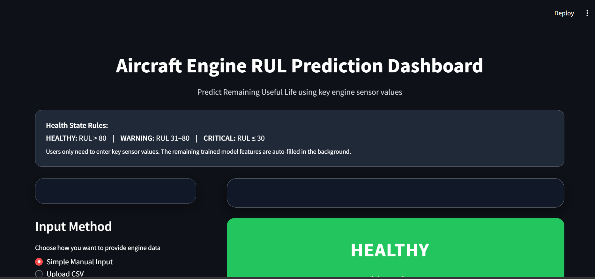
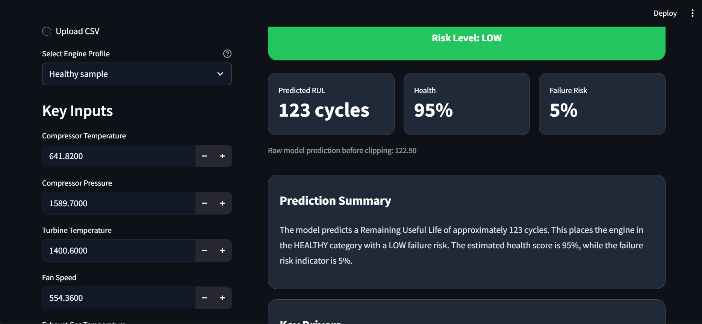
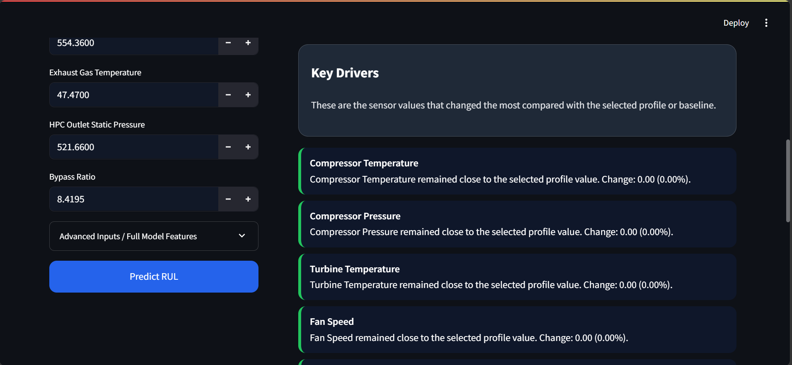
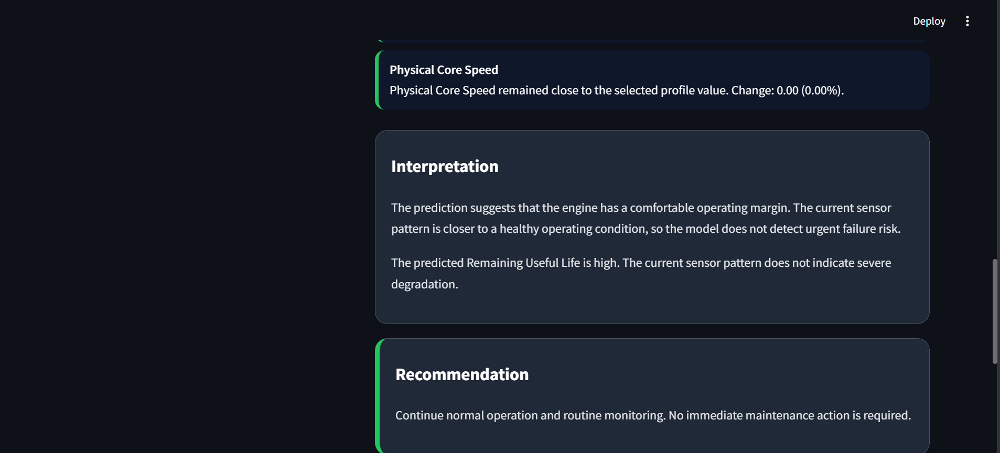
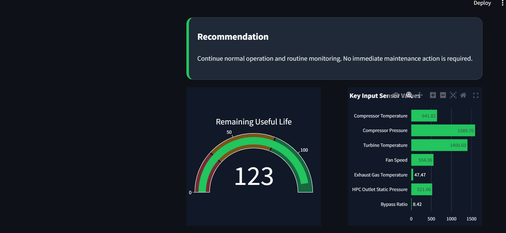

# ✈️ Aircraft Engine Remaining Useful Life Prediction Dashboard

## 📌 Project Overview

This project presents a machine learning-based predictive maintenance dashboard developed to estimate the Remaining Useful Life (RUL) of aircraft engines using sensor data. The project uses the NASA C-MAPSS FD001 dataset to analyze engine degradation patterns and predict how many operating cycles an engine can continue before maintenance or failure risk.

The system compares multiple regression models including SVR, Random Forest, and XGBoost. Based on model evaluation results, XGBoost was selected as the final model and integrated into an interactive Streamlit dashboard. The dashboard provides RUL prediction, engine health status, key driver analysis, interpretation, and maintenance recommendations.

---

## 🎯 Objectives

- Predict the Remaining Useful Life of aircraft engines using machine learning
- Analyze sensor-based engine degradation patterns
- Compare SVR, Random Forest, and XGBoost regression models
- Select the best model based on RMSE and R² Score
- Build an interactive Streamlit dashboard for predictive maintenance
- Classify engine condition as Healthy, Warning, or Critical
- Provide maintenance recommendations based on predicted RUL

---

## 📊 Key Metrics

| Metric | Description |
|---|---|
| Predicted RUL | Estimated remaining operating cycles before maintenance or failure risk |
| Health Status | Engine condition classified as Healthy, Warning, or Critical |
| Health Percentage | Engine health score calculated from predicted RUL |
| Failure Risk | Risk percentage based on remaining useful life |
| MAE | Measures average absolute prediction error |
| MSE | Measures average squared prediction error |
| RMSE | Measures prediction error of regression models |
| R² Score | Measures how well the model explains RUL variation |

---

## 📈 Model Evaluation Results

| Model | MAE | MSE | RMSE | R² Score |
|---|---:|---:|---:|---:|
| SVR | 12.4555 | 352.9065 | 18.7858 | 0.8132 |
| Random Forest | 13.2880 | 327.8760 | 18.1073 | 0.8265 |
| XGBoost | 13.0721 | 321.6098 | 17.9335 | 0.8298 |

---

## 🏆 Best Model Selection

XGBoost was selected as the final model because it achieved the best overall performance.

- Lowest RMSE: 17.9335
- Highest R² Score: 0.8298
- Strong performance in handling sensor-based degradation patterns
- Suitable for predictive maintenance use cases

---

## 🧠 Machine Learning Pipeline

```text
NASA C-MAPSS FD001 Dataset
        ↓
Data Loading and TXT to CSV Conversion
        ↓
RUL Calculation
        ↓
RUL Capping at 130 Cycles
        ↓
Feature Selection
        ↓
Engine-Level Train-Validation Split
        ↓
Feature Scaling using StandardScaler
        ↓
Model Training
SVR | Random Forest | XGBoost
        ↓
Model Evaluation
MAE | MSE | RMSE | R² Score
        ↓
Best Model Selection
        ↓
Model Saving using Joblib
        ↓
Streamlit Dashboard Deployment
```

---

## 🛠️ Tools and Technologies

- Python
- Pandas
- NumPy
- Scikit-learn
- XGBoost
- Joblib
- Streamlit
- Plotly
- Jupyter Notebook
- GitHub
- Streamlit Community Cloud

---

## 📂 Dataset Used

Dataset: NASA C-MAPSS FD001 Turbofan Engine Degradation Dataset

Files used:

- `train_FD001.txt`
- `test_FD001.txt`
- `RUL_FD001.txt`

Converted files:

- `train_FD001.csv`
- `test_FD001.csv`
- `RUL_FD001.csv`

The dataset contains engine operational settings and sensor readings collected over multiple engine cycles. These values are used to predict the Remaining Useful Life of each engine.

---

## 🔢 Input Features

The model uses 24 input features:

- Operational settings: `op1`, `op2`, `op3`
- Sensor readings: `sensor1` to `sensor21`

Target variable:

```text
RUL_capped
```

RUL calculation:

```text
RUL = Maximum cycle of engine - Current cycle
```

RUL was capped at 130 cycles to improve model stability and align the prediction range with the dashboard gauge.

---

## 🚦 Engine Health Classification

| Health Status | RUL Range | Risk Level |
|---|---|---|
| Healthy | RUL > 80 | Low Risk |
| Warning | RUL 31–80 | Medium Risk |
| Critical | RUL ≤ 30 | High Risk |

Health percentage formula:

```text
Health % = RUL / 130 × 100
```

Failure risk formula:

```text
Failure Risk = 100 - Health %
```

---

## 📈 Dashboard Features

- Remaining Useful Life prediction
- Engine health status classification
- Health percentage calculation
- Failure risk percentage
- RUL gauge chart
- Key sensor driver analysis
- Interpretation of prediction result
- Maintenance recommendation
- Healthy, Warning, and Critical sample profiles
- Simplified user input section
- Advanced input section for full feature control
- CSV upload option for prediction

---

## 🖼️ Dashboard Preview

### Aircraft Engine RUL Prediction Dashboard







---

## 📌 Business Value

- Supports predictive maintenance planning
- Helps identify engine failure risk early
- Reduces unexpected breakdowns
- Improves maintenance scheduling decisions
- Converts complex sensor data into simple dashboard insights
- Helps technical teams monitor engine health using machine learning
- Supports data-driven decision-making in aviation maintenance

---

## 🚀 Live Demo

🔗 [View Deployed Streamlit App]()

---

## 📂 Project Structure

```text
Aircraft-Engine-RUL-Prediction/
│
├── main.py
├── engine_rul_model_training.ipynb
├── rul_model.pkl
├── scaler.pkl
├── features.pkl
├── default_profiles.pkl
├── requirements.txt
├── README.md
└── screenshots/
    └── prediction_output.png
```

---

## 📄 File Description

| File | Description |
|---|---|
| `main.py` | Streamlit dashboard application |
| `engine_rul_model_training.ipynb` | Model training and evaluation notebook |
| `rul_model.pkl` | Saved best machine learning model |
| `scaler.pkl` | Saved StandardScaler object |
| `features.pkl` | Saved list of model input features |
| `default_profiles.pkl` | Saved Healthy, Warning, and Critical engine profiles |
| `requirements.txt` | Required Python libraries for deployment |
| `README.md` | Project documentation |
| `screenshots/prediction_output.png` | Dashboard output screenshot |

---

## ⚙️ Requirements

```txt
streamlit
pandas
numpy
scikit-learn
joblib
plotly
xgboost
```

---

## ▶️ Run Locally

Clone the repository:

```bash
git clone YOUR_GITHUB_REPOSITORY_LINK
```

Move into the project folder:

```bash
cd Aircraft-Engine-RUL-Prediction
```

Install required libraries:

```bash
pip install -r requirements.txt
```

Run the Streamlit app:

```bash
streamlit run main.py
```

---

## 🌐 Deployment

The project is deployed using Streamlit Community Cloud.

Deployment steps:

1. Upload all project files to GitHub
2. Go to Streamlit Community Cloud
3. Select the GitHub repository
4. Set the main file path as:

```text
main.py
```

5. Click Deploy

Important deployment files:

- `main.py`
- `rul_model.pkl`
- `scaler.pkl`
- `features.pkl`
- `default_profiles.pkl`
- `requirements.txt`

---

## 🚀 Future Improvements

- Add real-time aircraft sensor data integration
- Improve model performance using deep learning models such as LSTM
- Add batch prediction for multiple engines
- Include detailed feature importance visualization
- Add downloadable prediction reports
- Deploy with authentication for enterprise usage
- Extend the system to FD002, FD003, and FD004 datasets

---

## 📌 Conclusion

This project successfully builds a machine learning system for aircraft engine Remaining Useful Life prediction. The dataset is preprocessed, RUL is calculated, and three regression models are trained and compared.

Among SVR, Random Forest, and XGBoost, the XGBoost model achieved the best overall performance based on RMSE and R² Score. The trained model was then saved and integrated into a Streamlit dashboard.

The dashboard improves usability by allowing users to enter only key sensor values while automatically filling the remaining features. It provides a complete prediction output including RUL, health status, key drivers, interpretation, and recommendation.

This project demonstrates how machine learning can support predictive maintenance by helping users identify engine degradation early and plan maintenance actions more effectively.

---

## 👤 Author

**Hiba Fathima Y**  
Data Analyst / Data Science Enthusiast
